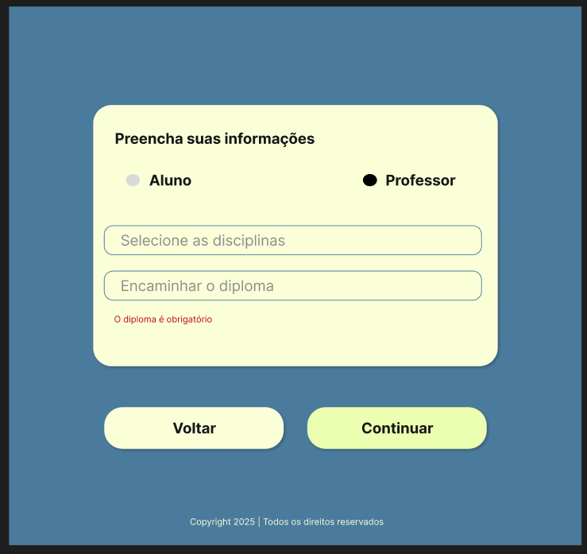

# Projeto Integrador III - Sistema de Gestão Universitária

Este repositório reúne os artefatos e entregas desenvolvidos no âmbito do **Projeto Integrador** do curso de **Tecnologia em Análise e Desenvolvimento de Sistemas** do **SENAC**.

O objetivo do projeto foi aplicar os conceitos de **modelagem de sistemas orientados a objetos** e **prototipação de software**,
utilizando a **UML (Linguagem Unificada de Modelagem)** para estruturar o sistema e ferramentas de desenvolvimento para dar início à implementação.

O trabalho foi realizado como parte das atividades da disciplina de **Projeto Integrador - Desenvolvimento de sistemas orientados a objetos**, em 2025.

## Sumário

- [Objetivos e metodologia](#objetivos-e-metodologia)
- [Diagrama de casos de uso](#diagrama-de-casos-de-uso)
- [Diagrama de classes](#diagrama-de-classes)
- [Protótipos](#protótipos)
- [Executando o projeto](#executando-o-projeto)
- [Estrutura do repositório](#estrutura-do-repositório)
- [Integrantes do grupo](#integrantes-do-grupo)

## Objetivos e metodologia

A proposta foi desenvolver um **sistema de gestão universitária**, considerando:

- Cadastro de Pessoa Física
- Cadastro de Pessoa Jurídica
- Cadastro de Professores
- Cadastro de Fornecedores
- Cadastro de Alunos

O desenvolvimento foi dividido em duas etapas:

### Primeira Etapa – Modelagem

- **Diagrama de Casos de Uso**
- **Descrição dos Cenários de Uso**
- **Diagrama de Classes**

### Segunda Etapa – Prototipação e Implementação

- **Protótipos de interface** desenvolvidos no **Figma**
- Organização do projeto em um repositório no **GitHub**
- Implementação inicial utilizando:
  - **Angular** no front-end
  - **Java com Spring** no back-end

## Diagrama de casos de uso


## Diagrama de classes


## Protótipos

- [Protótipo no Figma](https://www.figma.com/design/hF6Qumy1BqxiQK9tT2HxZT/Projeto-Integrador--PI-?node-id=0-1&t=sD4js2QupqKqUeQx-1)

### Tela inicial


### Cadastro - informações básicas


### Cadastro - CPF/CNPJ não informado


### Cadastro - CPF/CNPJ inválido


### Cadastro - CPF/CNPJ já cadastrado


### Cadastro PF - escolha de função


### Cadastro PF - função não informada


### Cadastro Professor


### Cadastro Professor - diploma não informado



### Cadastro Aluno


### Cadastro Aluno - certificado não informado


### Cadastro Fornecedor


### Cadastro Fornecedor - tipo de serviço não informado


### Tela de sucesso


## Executando o projeto

### Utilizando Docker Compose

1. Instale o [Docker e Docker Compose](https://docs.docker.com/compose/install/)

2. Clone o repositório e navegue até a pasta do projeto

3. Execute as aplicações:

```bash
docker compose up
```

4. Acesse a aplicação em http://localhost:4200

### Executando as Aplicações Separadamente

#### Frontend (Angular)

1. [Instale o Node.js 20.x](https://nodejs.org/en/download)

2. Navegue até a pasta do frontend:

```bash
cd app/frontend
```

3. Instale as dependências:

```bash
npm install
```

4. Inicie o servidor de desenvolvimento:

```bash
npm start
```

5. Acesse o frontend em http://localhost:4200

#### Backend (Spring)

1. [Instale o Java 17](https://www.oracle.com/br/java/technologies/downloads/)

2. Navegue até a pasta do backend:

```bash
cd app/backend
```

3. Execute a aplicação:

```bash
# No Linux/Mac:
mvn spring-boot:run

# No Windows:
mvnw.cmd spring-boot:run
```

4. A API backend estará disponível em http://localhost:8080

## Estrutura do Repositório

- `/docs` → Diagramas UML (casos de uso e classes)
- `/prototipos` → Protótipos desenvolvidos no Figma
- `/app`
  - `/frontend` → Código da aplicação Angular
  - `/backend` → Código da aplicação Java + Spring

## Integrantes do Grupo

- Cesar Alencar Delfino
- Guilherme Oliveira Silva
- Letycia Iwme Mangolin
- Nivaldo Aires de Lima Filho
- Pedro Papini de Araujo
- Samuel Siqueira Borges
